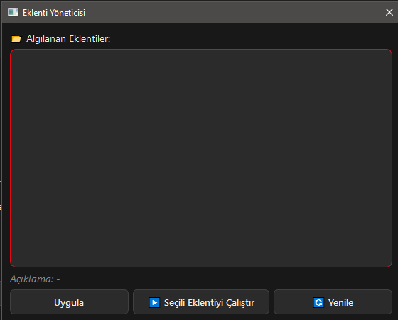
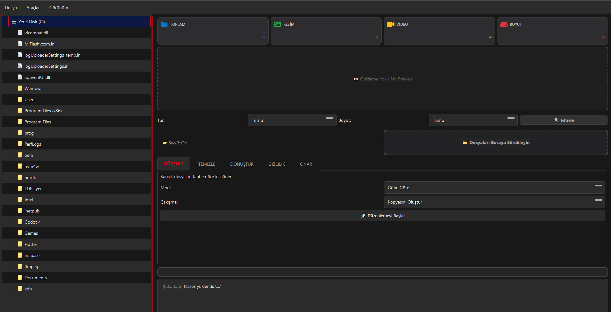

<div align="center">
  

# 📁 Media Manager Pro
### Fast, modern file organizer + duplicate cleaner for Windows (PySide6)

  <p>
    
    
    
    
    
  </p>

  <p>
    <strong>Media Manager Pro</strong> helps you clean up chaotic folders: organize by date, find duplicates, convert image formats, scrub metadata, and more.
    <br>
    Built for normal humans who would rather not spend their weekend renaming files.
  </p>

  <p>
    <a href="#-download">📥 Download</a> •
    <a href="#-features">✨ Features</a> •
    <a href="#-plugins">🧩 Plugins</a> •
    <a href="#-developer-setup">🛠️ Developer Setup</a> •
    <a href="#-roadmap">🗺️ Roadmap</a>
  </p>
</div>

---

## 🚀 Why this exists
Because “I’ll sort my photos later” is a lie we all tell ourselves.

- **Fast, practical tools** (no wizardry, no 17-step configs)
- **Modern desktop UI** (dark/light theme)
- **Safe file handling** (conflict modes: copy/overwrite/skip)
- **Extensible** (plugin system)

---

## ✨ Features

- **🗂️ Organize by date**
  - Sort mixed files into folders by **day / month / year**.

- **🧹 Duplicate cleaner (optimized)**
  - Size grouping first, hash only where needed.

- **🖼️ Image converter**
  - Convert between common formats (JPEG/PNG/WEBP/BMP/TIFF and more).

- **🛡️ Privacy mode**
  - Remove metadata (EXIF) from images.

- **🧩 Plugins**
  - Add custom tools without touching the core app.

- **🌍 Multi-language**
  - English + Turkish (and ready for more).

---

## 📥 Download

### Windows
- Go to **Releases** and download the latest build.

> SmartScreen warning can happen for unsigned apps.
> “More info → Run anyway” if you trust the source.

---

## 📸 Screenshots

| Dashboard | Organize Tab |
|:--:|:--:|
|  |  |

---

## 🧩 Plugins
Plugins live in the `plugins/` folder.

- Each plugin is a single `.py` file.
- Must expose a `Plugin` class.
- Can provide one or more menu actions.

Example plugin is included: `plugins/hello_plugin.py`.

---

## 🛠️ Developer Setup

```bash
git clone <your-repo-url>
cd MediaManagerPro
python -m venv .venv
.venv\Scripts\activate
pip install -r requirements.txt
python main.py
```

### Optional: enable the Repair feature
Repair uses OpenCV + NumPy + scikit-image:

```bash
pip install -r requirements-repair.txt
```

---

## 🧪 Build (EXE)
This repo includes a GitHub Actions workflow to build a Windows executable with PyInstaller.

Locally:

```bash
pip install pyinstaller
pyinstaller --noconsole --onefile main.py
```

---

## 🗺️ Roadmap
- Drag-and-drop multi-folder support
- Safer “dry run” mode before moves
- Better duplicate detection UI (preview + select)
- More languages

---

## 🤝 Contributing
PRs welcome. Read **CONTRIBUTING.md**.

---

## 📜 License
MIT. See **LICENSE**.
